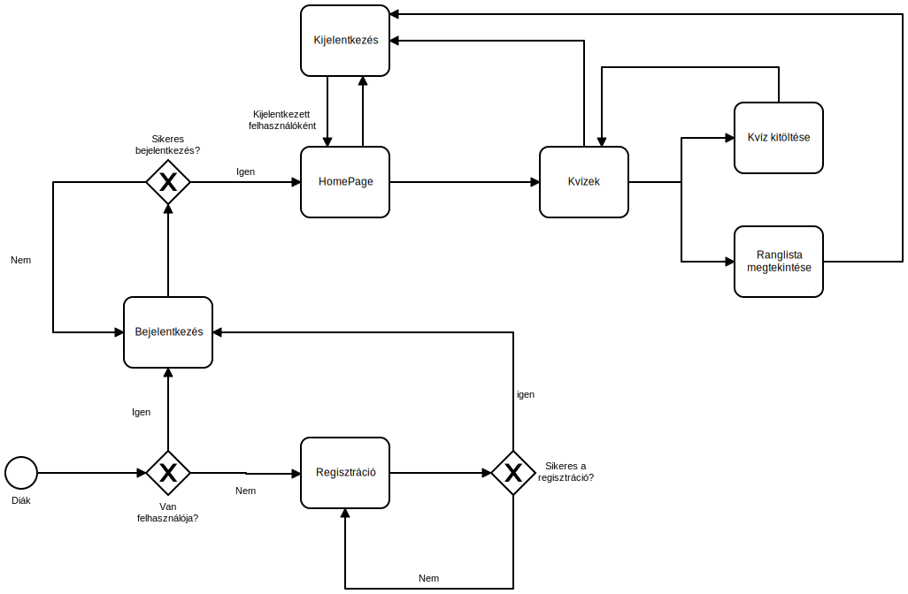
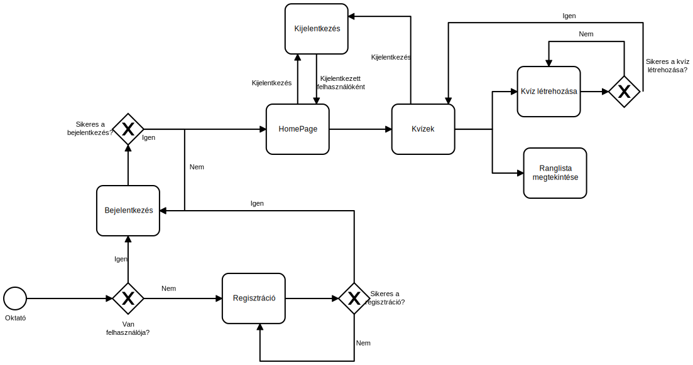

# Funkcióspecifikáció
* * *
## Tartalomjegyzék

- [Jelenlegi helyzet leírása](#jelenlegi-helyzet-leírása)
- [Kínált üzleti folymatok](#kínált_üzleti_folyamatok)
- [Követelménylista](#követelménylista)
- [Használati esetek](#használati-esetek)
- [Képernyőkép tervek](#képernyőkép-tervek)

#### Jelenlegi helyzet leírása

A Sári Gusztáv Általános Iskola és Alapfokú Művészeti Iskola (későbbiekben megrendelő) megkereste a Taco's Kft. fejlesztői csapatát miszerint reformálni szeretnék a gyermekek értékelését a mai modern eszközök segítségével. A megrendelő egyszerű és könnyen átáláthatő webalkalmazást kért a csapatunktól.
Tehát megrendelőnek szüksége van egy webalkalmazásra, amely lehetővé teszi, hogy XXI. századi eszközök segítségével értékeljék a gyermekek házi feladatait és akár dolgozatírást is tudjanak a segítségével lebonyolítani. A webalkalmazás kvízek segítségével százáalékokkal értékeli a tudást, megadott válaszok alapján. A webalkalmazás megkülönböztet admin és sima mezei felhasználót. Az admin jogosultsággal rendelkező emberek alkotják a tanárokat, míg a diák csak sima felhasználói jogosultságot kapjon.

#### Kínált üzleti folyamatok
######Diák üzleti folyamat
 
 
######Oktató üzleti folyamat
 

#### Követelménylista

###### A megrendelő által kért funkciók
- Szabad regisztráció egyedi felhasználói névvel
- Tanárok tudjanak kvízeket létrehozni és kitölteni
- Az aktuális kvízek listázhatóak és kitölthetőek legyenek
- Diákok és a tanárok is tudjanak kvízeket kitölteni
- Kvízeken elérhető pontszámok és az adott felhasználó által elért pontszámok megjelenítése
- A három féle kvíz megadása (dolgozat, gyakorlás, házifeladat)
- A dolgozat típusú kvíz időkorlátos legyen
- A dolgozat és házi feladata kvízeket ne tudjon egy felhasználó egynél többször kitölteni
- Minden felhasználó ki tudjon jelentkezni az oldalról

###### Az általunk vállalt funkciók
- Szabad regisztráció egyedi felhasználói névvel
- Tanárok tudjanak kvízeket létrehozni és kitölteni
- Kvízek listázása
- Minden jogosultsággal lehet kvízt kitölteni
- Elérhető és megszerzett pontok megjelenítése kvízekhez
- Bármely felhasználó kijelentkezhet az oldalról

###### Azok a funkciók amiket a megadott időn belül nem tudunk vállalni
- A három kvízfajta megkülönböztetése (a megadott időn belül csak egy fajta kvízt vagyunk képesek elkészíteni, amin nincs korlát, valós időben nem megtekinthető vagy szakítható az oktató által)

#### Használati esetek

#### Képernyőkép tervek

