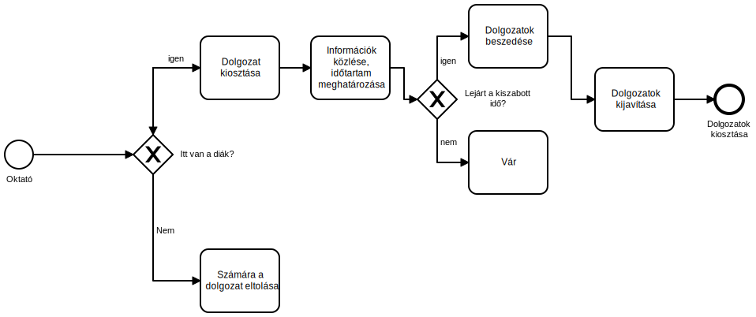

# Követelményspecifikáció
* * *
## Tartalomjegyzék
- [Áttekintés](#áttekintés)
- [Jelenlegi helyzet](#jelenlegi-helyzet)
- [Vágyálom rendszer](#vágyálom-rendszer)
- [Jelenlegi üzleti folyamatok](#jelenlegi-üzleti-folyamatok)
- [Kívánt üzleti folyamatok](#kívánt-üzleti-folyamatok)

#### Áttekintés
A kabai Sári Gusztáv Általános Iskola a XXI. század által kínált és állított lehetőségekre, illetve akadályokra szeretne egy webes alkalmazást.
Az iskola kérése egy egyszerű felhasználói felülettel ellátott weboldal, ahol a tanárok  online mérhetik fel a diákjaik tudását. Ezzel a honlappal próbálják, majd kiváltani a házifeladatokat és a dolgozatkat. Ezzel szeretnénk a gyerekekhez közelebb hozni a házifeladat-írást és így javítani  az átlagos eredményeken.
#### Jelenlegi helyzet
- **Dolgozat**: Rövid időközönként, adott időn belül (ez függ az óra típusától) kell egy oktató által összeállított tesztet teljesíteni legalább 50%-os eredménnyel. Ehhez szükséges a fizikai jelenlét, így ha esetleg egy tanuló nem tud megjelenni az órán, akkor rögtön csúszik a tananyaggal. A dolgozat kitöltése papíron történik az oktató által előírt írószerrel. 
- **Házi feladat**: Az okató általál előírt témában otthon elvégezendő tevékenység. Rendszerint papíron történik.
- **Gyakorlás órán**: Tanórákon tankönyvben kitölthető feladatokat oldunk meg, ez gyakran nem ellenőrizhető megfelelően.
#### Vágyálom rendszer
- **Dolgozat**: Legyen egy időlimit egyes kvízeken, amelyeket az oktató ad meg, ha ez lejár, akkor automatikusan értékelje ki az addigi megoldásait a tanulónak. Ha végzett, az eredményt válaszokkal együtt küldje el az oktatónak, aki meg tudja nézni a tanuló válaszait. Ha egy kvízt sikeresen teljesítettek, akkor ne legyen lehetősége újra próbálni azt. Az oktatóknak lehetőségük nyíljon korlátlan mennyiségű kvízt létrehozni korlátlan mennyiségű válaszlehetőséggel, és kérdéssel.
- **Házi feladat**: Tulajdonképpen hasonlóan szeretnénk a  házi feladat elkészítését is, az időkorlát nélkül. A pontrendszert alább részletesebben leírom.
- **Gyakorlás órán**: Az oktatónak lehetősége legyen valós időben megtekinteni egy tanuló aktuális feladatát, kvíz feladatát, és le tudja állítani bármikor azt.
#### Jelenlegi üzleti folyamatok
 

#### Kívánt üzleti folyamatok
A webalkalmazásban szeretnénk, hogy legyen egy bejelentkező felület, ahol a diákjaink és tanáraink egy általuk megadott felhasználói névvel tudnak bejelentkezni. Amennyiben nincs még felhasználói fiókjuk, erről a felületről elérhető legyen egy regisztrációs felület. 
Szeretnénk, ha minden felhasználó képes lenne kvízek kitöltésére, de csak a tanárok hozhassanak létre új kvízeket. 
A kvízeket százalékokkal és pontszámmal is szeretnénk értékelni, amelyeket a kvízek kilistázásakor lát is az adott felhasználó. 
Szeretnénk három féle kvízt megkülönböztetni:
- **Gyakorlás**, ami az oktató által bármikor megtekinthető és leállítható.
- **Dolgozat**, ami időkorlátos és a időkorlátot elérve rögtön kiértékelt. Nem újrapróbálhatókvíz
- **Házi feladat**, hasonló a dolgozathoz, de nincs benne időkorlát.  

A felületről a kijelentkezés gombot bárhonnan elérhetővé szeretnénk tenni, hisz nem kívánjuk a gyermekek szünetét ilyesfajta "adminisztrációval" ellopni.

