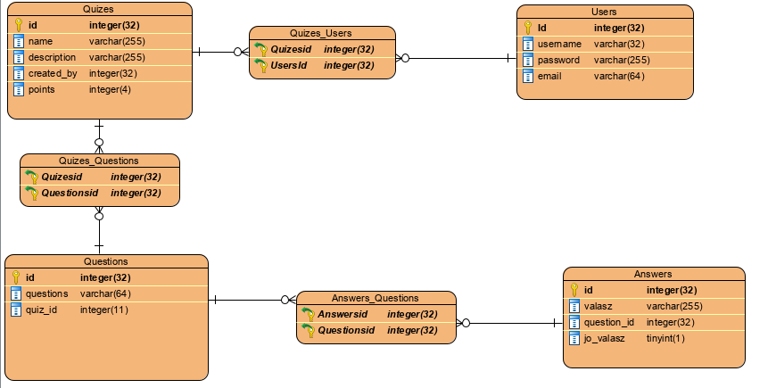

# Rendszerterv

## Tartalomjegyzék
- [Bevezető](#bevezető)
- [Fizikai környezet](#fizikai-környezet)
- [Domain modell](#domain-modell)
- [Architekturális terv](#architekturális-terv)
- [Felhasználói felület](#felhasználói-felület)
- [Adatbázis terv](#adatbázis-terv)
- [Üzleti folyamatok](#üzleti-folyamatok)
- [Tesztterv](#tesztterv)

#### Bevezető

#### Fizikai környezet

#### Domain modell

#### Architekturális terv

#### Adatbázis terv

#### Felhasználói felület

#### Üzleti folyamatok

#### Tesztterv

 <table  style="width:100%" >
 
 <tr >
 <th> Tesztjegy
 <th> Modul
 <th> Művelet
 <th> Hatás
 </tr>

 <tr>
 <td>H0001
 <td>Bejelentkezés
 <td>A bejelntkező űrlapot olyan felhasználó és jelszó párral töltik ki ami előzetesen nem regisztrált a rendszerben.
 <td> Hiba, a felület kijelzi, hogy a felhasználó és jelszó páros nem helyes.
 </tr>
 
 
 <tr>
  <td>H0002
  <td>Bejelentkezés
  <td>A bejelntkező űrlapot olyan felhasználóval töltik ki ami nem szerepel az adatbázisan.
  <td> Hiba, a felület kijelzi, hogy a felhasználó nem szerepel a rendszerben.
  </tr>
  
  <tr>
   <td>H0003
   <td>Bejelentkezés
   <td>A bejelntkező űrlapot olyan  jelszóval párral töltik ki ami nem szerepel az adatbázisban.
   <td> Hiba, a felület kijelzi, hogy a jelszó nem szerepel az adatbázisban.
   </tr>
   
   <tr>
    <td>H0004
    <td>Bejelentkezés
    <td>A bejelntkező űrlapot olyan felhasználó és jelszó párral töltik ki ami szerepel az adatbázisan.
    <td> Siker, a felület a "Home" oldalra irányít át.
    </tr>
    
   <tr>
      <td>H0005
      <td>Regisztráció
      <td> A regisztrációs űrlap email mezőjében a beírt szöveg megfelel az email cím szabványnak és a többi mező nem üres.
      <td> Siker, a felület a "Home" oldalra irányít át, bejelentkezve.
   </tr>
   
   <tr>
         <td>H0006
         <td>Regisztráció
         <td> A regisztrációs űrlap email mezőjében a beírt szöveg nem megfelel az email cím szabványnak és a többi mező nem üres.
         <td> Hiba, a felület kijelzi, hogy az email mezőbe írt szöveg nem megfelelő emailcím.
   </tr>
   <tr>
         <td>H0007
         <td>Regisztráció
         <td> A regisztrációs űrlap email mezőjében a beírt szöveg megfelel az email cím szabványnak és a többi mező üres.
         <td> Hiba, a felület kijelzi, hogy a felhasználó, jelszó és a jelszó megerősítő túl rövid vagy nincs kitöltve.      
   </tr>
   
  <tr>
        <td>H0008
        <td>Regisztráció
        <td> A regisztrációs űrlap email mezőjében a beírt szöveg megfelel az email cím szabványnak és a jelszó mezőbe beírt karaktersorozat hossza kisebb mint 6
        <td> Hiba, a felület kijelzi, hogy a jelszó mezőbe írt karaktersorozat túl rövid.
  </tr>
    <tr>
          <td>H0009
          <td>Regisztráció
          <td> A regisztrációs űrlap email mezőjében a beírt szöveg megfelel az email cím szabványnak és a jelszó mezőbe beírt karaktersorozat hossza nagyobb vagy egyenlő mint 6, viszont a felhasználónév már megtalálható az adatbázisban.
          <td> Hiba, a felület kijelzi, hogy a felhaználónév már szerepel az adatbázisban, válasszon ettől különbözőt.
    </tr>
     <tr>
           <td>H0010
           <td>Regisztráció
           <td> A regisztrációs oldalon a "Lépj be!" szövegre kattintás.
           <td> Siker, az webalkamazás átirányít a bejelentkező oldalra,
     </tr>
      <tr>
            <td>H0011
            <td>Home
            <td> A kijelentkezés gombra kattintás.
            <td> Siker, felugró ablakban jelezve, a felhasználó kiléptetését.
      </tr>
    <tr>
       <td>H0012
       <td>Home
       <td> A Kvízek gombra kattintás,
       <td> Siker, átirányítás a kvíz oldalra, ahol megjelennek a kvízek egy táblázatban.
    </tr>
    <tr>
      <td>H0013
      <td>Kvíz
      <td> A "kvíz kezdése" linkre kattintás.
      <td> Siker, átirányítás az adott kvíz oldalára.
    </tr>
    <tr>
      <td>H0014
      <td>Kvíz
      <td> A kvíz oldalán található "Vissza a kvízekhez" gombra kattintás,
       <td> Siker, átirányítás a kvízek listájának oldalra.
    </tr>
     <tr>
           <td>H0015
           <td>Kvíz
           <td> A kvíz oldalán található "kvíz kezdése" gombra kattintás,
           <td> Siker, átirányítás a kvíz első kérdésére.
     </tr>
      <tr>
            <td>H0016
            <td>Kvíz
            <td> "Következő kérdés" gombra kattintás, kiválasztott válasz nélkül,
            <td> Hiba, felugróablakban jelezve hogy nem választott semmit,
       </tr>
     <tr>
       <td>H0017
       <td>Kvíz
       <td> "Következő kérdés" gombra kattintás, kiválasztott válasszal.
       <td> Siker, továbblépés a következő kérdésre.
      </tr>
      <tr>
        <td>H0018
       <td>Kvíz
        <td> Az utolsó kérdés esetén a "következő kérdés" gomra való kattintás.
       <td> Siker, felugró ablakban jelezve az eltalált válaszok arányát, siker esetén a megfelelő pontok hozzáadása a felhasználó pontjaihoz, ellenkező esetben semmi nem történik és továbbirányítás a kvízek listájára.
      </tr>
         
      
    
     
 </table>