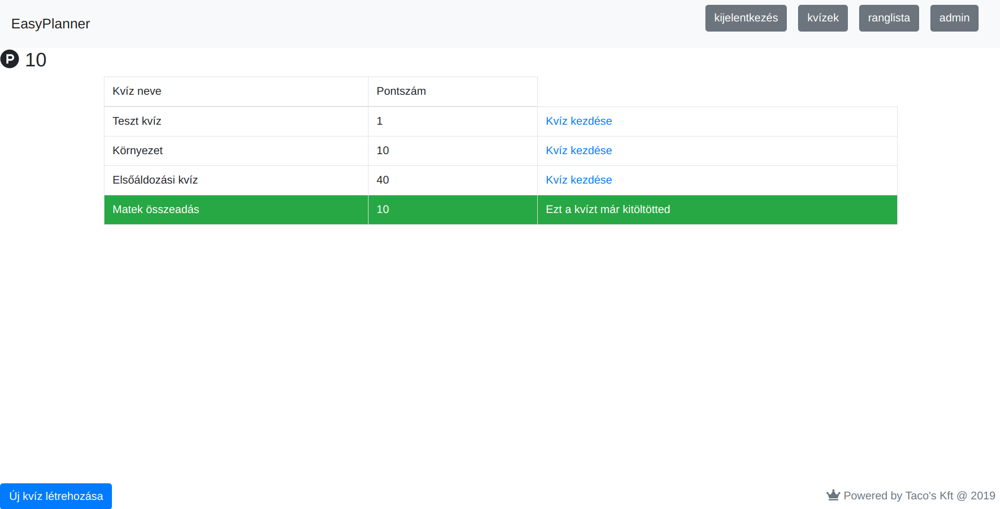

# Rendszerterv
* * *
## Tartalomjegyzék
- [Bevezető](#bevezető)
- [Mérföldkövek](#Mérföldkövek)
- [Fizikai környezet](#fizikai-környezet)
- [Architekturális terv](#architekturális-terv)
- [Felhasználói felület](#felhasználói-felület)
- [Adatbázis terv](#adatbázis-terv)
- [Üzleti folyamatok](#üzleti-folyamatok)
- [Tesztterv](#tesztterv)

#### Bevezető

A program célja, hogy a Sári Gusztáv Általános Iskola és Alapfokú Művészeti Iskola az erdők védelme érdekében online tudjon dolgozatot íratni. Szeretnének egy online felületet, amin keresztül kvíz kérdés alapú dolgozatot tudnak íratni a tanárok.

#### Mérföldkövek

A kvíz projekt mérföldkövei a következők:
1. Mérföldkő: A domain meghatározása és megfelelő szoláltató keresése.
2. Mérföldkő: A bejelentkező felület elkészítése
3. Mérföldkő: A regisztrálciós felület elkészítése
4. Mérföldkő: A kvízek listázási felületének elkészítése
5. Mérföldkő: Új kvíz létrehozási felületének elkészítése
6. Mérföldkő: Kvíz felület elkészítése
7. Mérföldkő: Kvíz értékelő elkészítése
8. Mérföldkő: Tesztelés
9. Mérföldkő: 1.0-ás verzió átadása

#### Fizikai környezet

A projekt webalkalmazásként valósul meg a megrenedlő kérésének megfelelően.  
A webalkalmazás domain-je a www.easyplanner.hu.  
Ennek következtében a fizikai környezet melyet a projekt megkövetel a tervezett használathoz a következőek.
- Böngésző futtatására alkalmas eszköz:
	- Okos készülékek (modern maroktelefon vagy tablet), asztali számítógép vagy laptop
- A projekt támogatja az összes modern mainstream böngészőt, így a használathoz alkalmazása ezek ajánlott (a projektet csak a felsorolt böngészőkben teszteltük):
	- Firefox
	- Google Chrome
	- Microsoft Edge
	- Opera
- A fentiekből következik, hogy a projekt optimális használatának érdekében a stabil internet elérés elengedhetetlen.

#### Architekturális terv

A webalkalmazás **PHP** nyelven íródik, mindenféle keretrendszer nélkül. 
Rendszerünkhöz az **MVC (Model View Controller)** szoftvertervezési mintát használjuk. 
Három főbb modulból áll:
- **Azonosítási modul**: Magába foglalja mind a bejelentkezés rendszert, és a regisztrációs rendszert is. Ebben kezelünk olyan adatokat mint például a jelszó megváltoztatás, illetve, hogy a felhasználó be van-e jelentkezve. Tartalmaz továbbá felületi elemeket, amely a vezérlő és a nézet rétegeket fedik le, ezek öröklődnek a bizonyos <i>Abstract Page</i> osztályból, ahol főképpen a futási sorrendet kontrolláljuk, így biztosítva hogy előbb fusson le a vezérlő, majd csak utána jelenítse meg a felhasználónak az adatokat.  
**A modul a következő osztályokat tartalmazza**:
-- Authentication
-- Login_Page
-- Register_Page
- **Kvíz modul**: Ez a rendszer magja, az ebben található komponenseket kizárólag bejelentkezett felhasználók használhatják. Ebben a modulban találhatók a következők: kvíz lista, a kiválasztott kvíz kezelése, ranglista kialakítása, új kvízek létrehozása. A felületi oldalak úgyszint az <i>Abstract Page</i>-ből öröklődnek. A vannak a model rétegben olyan elemek amelyek **ORM (Object Relational Mapping)** szerepet is betöltenek.
**A modul a következő osztályokat tartalmazza**:
-- Answer
-- Quiz
-- Create_Quiz_Page
-- Quiz_List_Page
-- Quiz_Page

Az adatok többnyire perzisztensek, ezért amíg a felhasználó SESSION-je tart, addig a felhasználó információja nem vész el. Az előnyei itt a kérdések hozzáadásánál jön elő, mikor több kérdést kell eltárolni akár több száz oldal újratöltés után is. 
Adatbáziskezelésre **MySQL**-t használunk fejlesztőink preferenciája miatt.  
Kódunkban pedig **Singleton** programtervezési mintát használunk a <i>Database</i> osztályunkban.
Továbbá védjük az SQL lekérdezéseinket SQL injection ellen, így nem tudják lekérni a felhasználók adatait egy trükkös SQL lekérdezéssel. 
Kvíz sorszámon és az aktuális oldalon kívül GET-es kéréssel semmit nem kezelünk, ezzel is védve a rendszert.

#### Adatbázis terv
  
 <code>CREATE TABLE IF NOT EXISTS `users` (  
 `id` int(32) NOT NULL, 
   `username` varchar(32) NOT NULL, 
   `password` text NOT NULL, 
   `email` varchar(64) NOT NULL) 
    ENGINE=InnoDB AUTO_INCREMENT=14 DEFAULT CHARSET=utf8;  
 ALTER TABLE `users` 
  ADD PRIMARY KEY (`id`);    
  CREATE TABLE IF NOT EXISTS `quizes` ( 
  `id` int(32) NOT NULL, 
    `name` varchar(64) NOT NULL, 
    `description` text NOT NULL, 
    `created_by` int(32) NOT NULL, 
    `points` int(4) NOT NULL )   
    ENGINE=InnoDB AUTO_INCREMENT=27 DEFAULT CHARSET=utf8;    
     ALTER TABLE `quizes` 
      ADD PRIMARY KEY (`id`);
       
 CREATE TABLE IF NOT EXISTS `answers` ( 
  `id` int(32) NOT NULL, 
  `valasz` text NOT NULL, 
  `question_id` int(32) NOT NULL, 
  `jo_valasz` tinyint(1) NOT NULL 
) ENGINE=InnoDB AUTO_INCREMENT=122 DEFAULT CHARSET=utf8; 
 
ALTER TABLE `answers` 
 ADD PRIMARY KEY (`id`); 
  
 CREATE TABLE IF NOT EXISTS `questions` ( 
  `id` int(32) NOT NULL, 
  `question` varchar(64) NOT NULL, 
  `quiz_id` int(11) NOT NULL 
) ENGINE=InnoDB AUTO_INCREMENT=52 DEFAULT CHARSET=utf8; 
 
ALTER TABLE `questions` 
 ADD PRIMARY KEY (`id`);
</code>
#### Felhasználói felület
- **Bejelentkezés**:  A felhasználó két kitöldenő mezőt lát egymás mellett, illetve két gombot. 
A kitöltendő mezők nevei: "Felhasználónév", "Jelszó". 
A gombok a submit, illetve a regisztrációs oldalra való átirányításért felelősek.

- **Regisztráció**: A felhasználó négy kitöltendő mezőt lát kétszer kettes táblában, illetve két gombot. 
A kitöltendő mezők nevei: "Felhasználónév", "Email", "Jelszó", "Jelszó megerősítés". 
A gombok a submit, illetve a belépés oldalra való átirányításért felelősek.

- **Home**: Az az oldal, ahova a felhasználó megérkezik minden egyes bejelentkezés után.

- **Kvíz**: Ezen az oldalon lesznek láthatóak egy táblázatban a kitölthető és kitöltött kvízek.
 
#### Üzleti folyamatok

A felhasználóknak két csoportját különböztetjük meg a webalkalmazásban. 
Az oktatok rendelkeznek a nagyobb jogkörrel az admin jogosultsággal rendelkezők (tehát oktatók) lehetőségei a kvízek létrehozásával bővül a sima felhasználóéval szemben.
###### Diák üzleti folyamat

A diákok számára rendelkezésre álló lehetőségek a következőek:
- Amennyiben nincs felhasználói fiókunk: Az oldel a HomePage helyzetben van és egyetlen a felhasználó számára elérhető lehetőség a regisztrálció amit a bejelentkezés felület alatt tud elérni a felhasználó (Még nem regisztrált? kattintható linken).  Sikeres regisztrálció esetén az alkalmazás bejelentkeztetni a felhasználót, míg sikertelen esetén az oldal a regisztrálciós felületen marad, mindaddig míg az adatokat nem adjuk meg a kért módon.
- Amennyiben már regisztrált és csak felhasználói jogosultsággal rendelkezik az adott felhasználó, (tehát diák) sikeres bejelentkezés után a Kvízeket listázhatja. A listázott kvízek közül kiválaszthatja a kitölteni kívántat vagy lekérheti a ranglistát. Bármely tevékenységet is választja minden felületen elérhető számára a kijelentkezés funkció is.

 
 
###### Oktató üzleti folyamat

Az oktató számára elérhető funkciók:
Az oktató (tehát admin) minden funkciót képes elvégezni ami a diák számára is elérhető. 
Az admin jogkört nem az oldalon igényelheti egy felhasználó, hanem a rendszer üzemeltetője osztja azt ki a számára megadott felhasználóknak. 
Az oktató számára a kvízek lekérdezse után elérhetú egy új kvíz létrehozása funkció. A kvíz létrehozásában meg kell adja a kvíz nevét, rövid leírását, a kvízen szerezhető pontszámot. A kérdéseket az oktató egyesével adja hozzá a kvízhez. Minden egyes kérdéshez a válaszokat is meg kell adjuk. A helyes választ a válasz melletti kattintható gombal jelölni kell. Amint elkészült a teljes kvízt lehetősége van menteni vagy törölni.
 

